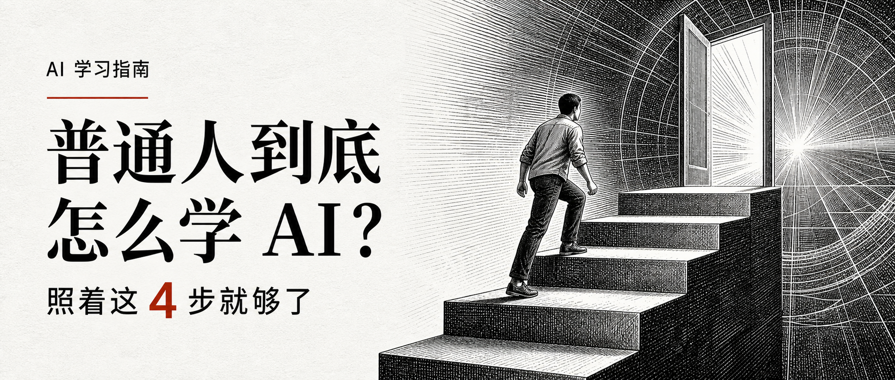

# 知识类自媒体封面 Skill

一套用于生成统一中文知识类自媒体封面的 Codex Skill。它把栏目封面固定成可持续复用的视觉系统：暖象牙纸、大标题、暗红标签与分隔线，以及一张黑白或克制彩色的概念主图。

只需提供分类和标题，Skill 就能自动补全副标题与主视觉隐喻，并为不同平台分别构图。

## 主要能力

- 自动从分类与标题提炼简洁副标题；
- 自动把主题转成一个清晰、可读的动作型视觉隐喻；
- 支持默认的 `黑白主版` 与可选的 `克制彩色版`；
- 支持 `弱视觉`、`强视觉` 和竖版 `右侧半隐人物构图`；
- 支持竖屏、公众号和 X 三种原生构图，不用同一张图强行裁切；
- 用完整高度的文字保护区确保标题不被人物、道具、阴影或装饰线干扰；
- 保持同一套暖象牙背景、暗红标签、双分隔线与标题优先层级。

## 参考效果

### 3:4 竖屏版


### 公众号横版



参考图只用于约束版式、层级、色彩和完成度。每次生成都会根据新主题替换文字、人物、物体和视觉隐喻。

## 安装

将本仓库克隆或下载后，把整个项目目录复制到个人 Codex Skills 目录，并保持目录名为：

```text
~/.codex/skills/create-knowledge-media-cover
```

目录内的 `SKILL.md` 是 Skill 入口，`agents/openai.yaml` 提供 Codex 界面信息，`references/` 保存详细的提示词与版式规范，`assets/` 保存参考图。

## 使用方式

最简调用只需要分类和标题：

```text
使用 $create-knowledge-media-cover 做一张竖屏封面。
分类：AI 学习指南
标题：普通人到底怎么学 AI？
```

没有提供副标题或主视觉时，Skill 会自动推断并继续生成。也可以明确指定更多要求：

```text
使用 $create-knowledge-media-cover 做三个平台版本。
分类：效率工具
标题：真正拉开差距的，不是工具数量
副标题：从收集工具到建立自己的工作系统
视觉：一个人把散落工具接成一条稳定的流水线
模式：黑白主版、强视觉
```

## 快捷指令

| 说法 | 输出 |
| --- | --- |
| `做封面` | 默认生成竖屏版 |
| `做竖屏版` / `做 3:4` | `900 × 1200` |
| `做公众号版` | `900 × 383` |
| `做 X 版` / `做推特版` | `1500 × 600` |
| `做三个平台版本` / `做全套` | 三种比例分别原生构图 |
| `做两个版本` | 同一文案生成弱视觉与强视觉两版 |
| `做右侧半隐人物竖屏版` | 竖屏强视觉、标题优先的右侧局部人物构图 |

## 视觉系统

| 项目 | 规范 |
| --- | --- |
| 背景 | 暖象牙纸 `#F4F0E6` |
| 正文与标题 | 近黑色 `#090909` |
| 点缀 | 暗红色 `#981B16` |
| 分类 | 小型暗红实底标签、暖象牙色粗体字 |
| 标题 | 最大视觉焦点，粗重无衬线字体，2–4 行 |
| 分隔 | 标题上下各一条相同的暗红短横线 |
| 副标题 | 小于标题，仅突出一个数字或短关键词 |
| 主视觉 | 右侧一张概念主图、一个核心隐喻，不进入文字保护区 |

默认使用黑白主版：主图中的人物、服装、道具、反射和阴影全部保持中性灰阶，暗红只用于文字系统中的有限点缀。克制彩色版允许低饱和自然色，但不改变背景、版式和标题层级。

## 文件结构

```text
create-knowledge-media-cover/
├── SKILL.md
├── README.md
├── agents/
│   └── openai.yaml
├── assets/
│   ├── reference-vertical-3x4.png
│   └── reference-wechat-wide.png
└── references/
    └── prompt-pattern.md
```

## 自定义

- 在 `SKILL.md` 中调整平台预设、默认视觉模式与生成规则；
- 在 `references/prompt-pattern.md` 中调整字体、字号、留白、标签和构图参数；
- 替换 `assets/` 中的参考图来迭代系列视觉，但应同步更新规则，避免参考图与文字规范冲突。

建议保留三个核心原则：标题始终是第一视觉焦点；一张主图只表达一个隐喻；文字区从顶部到底部都不允许任何插画元素进入。
